## Outline

1. Problem Statement & Data
2. Exploratory Data Analysis
3. Machine Learning 
4. Summary

--- .dark .segue

## Problem Statement & Data

---
## Problem Statement 

about users who hit our site: whether they converted or not as well as some of their characteristics such as:<br>

* their country - country <br>
* the marketing channel - source <br>
* their age - age 
* whether they are repeat users - new_user
* the number of pages visited during that session - total_pages_visited <br>  

---
## Data

```r
require(data.table)
data = fread('conversion_data.csv',header = T,stringsAsFactors = T)
kable(data[1:10,], format = "markdown",row.names = FALSE)
```

```
## Error in eval(expr, envir, enclos): could not find function "kable"
```

---
## Data


```r
kable(summary(data))
```

```
## Error in eval(expr, envir, enclos): could not find function "kable"
```

1. seems a U.S. site
2. Max age 123 seems does not make sense

So, let's dig in the distribution of age

---
## Distribution of Age


```r
data %>% ggplot(aes(x=age)) + geom_histogram(binwidth=5)
```

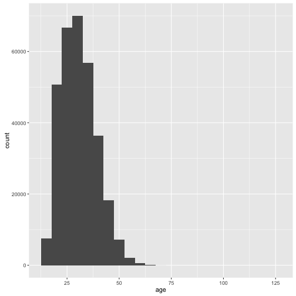

---

## Distribution of Age

```r
sort(data$age,decreasing = T)[1:20]
```

```
##  [1] 123 111  79  77  73  72  70  70  69  69  69  68  68  68  68  68  67
## [18]  67  67  67
```

```r
kable(subset(data, age>100))
```

```
## Error in eval(expr, envir, enclos): could not find function "kable"
```

Seems these 2 obervations (of 316200) are just unrealistic on the age dimension,
Thus, we could <br>
1. try to figure out whether there is a bug in the data collection mechanism<br>
2. just remove these two from the data set (althought it might not cause changes to the result ) <br>


--- .dark .segue

## Exploratory Data Analysis

---
## EDA - country

```r
data %>% group_by(country) %>% summarise(conversion_rate = mean(converted)) %>% 
  ggplot(aes(x=country,y=conversion_rate,fill=country))+geom_bar(stat='identity')
```

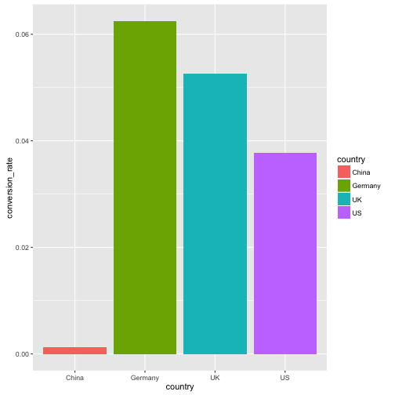

---
## EDA - total_pages_visited

```r
data %>% group_by(total_pages_visited) %>% summarise(conversion_rate = mean(converted)) %>% 
  ggplot(aes(x=total_pages_visited,y=conversion_rate))+geom_line(stat='identity')
```

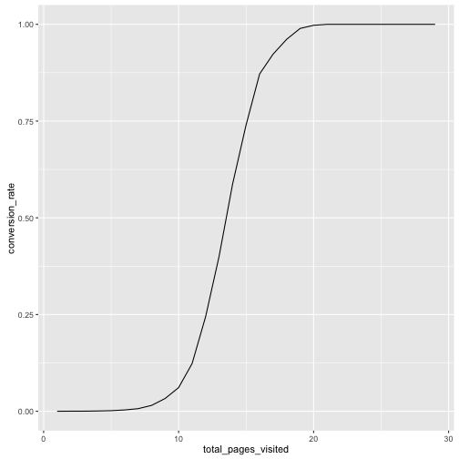

---
## EDA - new_user

```r
data$new_user = data$new_user %>% as.factor(.)
data %>% group_by(new_user) %>% summarise(conversion_rate = mean(converted)) %>% 
  ggplot(aes(x=new_user,y=conversion_rate,fill=new_user))+geom_bar(stat='identity')
```

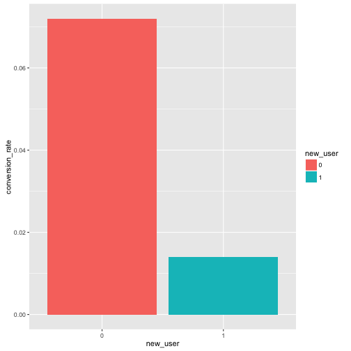
* users with older accounts have high conversion rate

---
## EDA - source

```r
data %>% group_by(source) %>% summarise(conversion_rate = mean(converted)) %>% 
  ggplot(aes(x=source,y=conversion_rate,fill=source))+geom_bar(stat='identity')
```

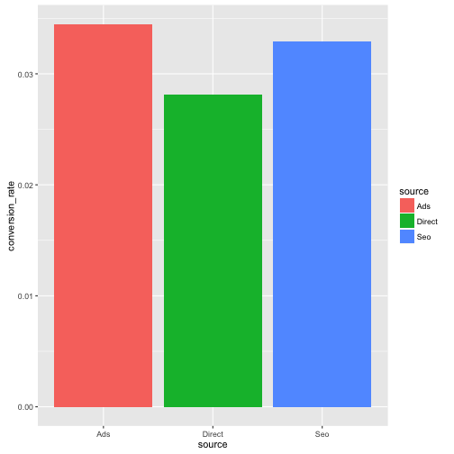
* users with older accounts have high conversion rate

---
## EDA - source

```r
t.test(data[source=='Ads',converted],data[source=='Seo',converted])$p.value
```

```
## [1] 0.03711654
```
* The difference between source is significant

---
## EDA - source, country

```r
data %>% group_by(country,source) %>% summarise(conversion_rate = mean(converted)) %>% 
  ggplot(aes(x=country,y=conversion_rate,fill=source))+geom_bar(stat='identity',position=position_dodge())
```

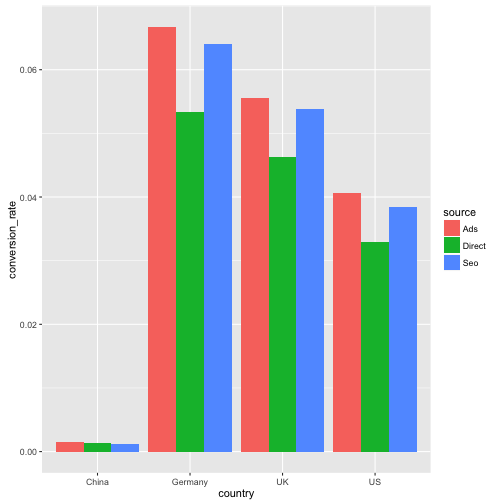
* China is the much different from others

---
## EDA - age

```r
data %>% ggplot(aes(x=age,fill=factor(converted))) + 
  geom_histogram(binwidth = 5,alpha=.5, position="identity")
```
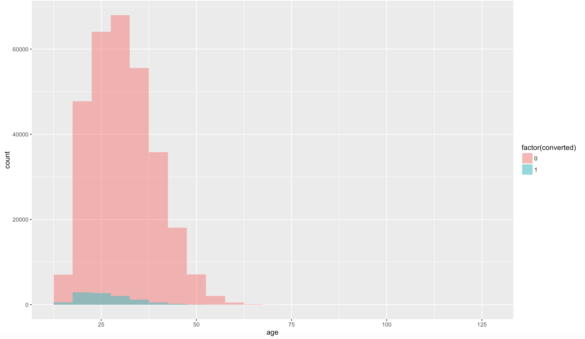 <br>
* the age distribution of those who do not convert is symmetric, but thosewho converted is right-skewed

---
## EDA - age vs. country

```r
data %>% ggplot(aes(x=age,fill=factor(converted))) + geom_histogram(binwidth = 5,alpha=.5, position="identity") + facet_wrap(~country,scales = "free")
```
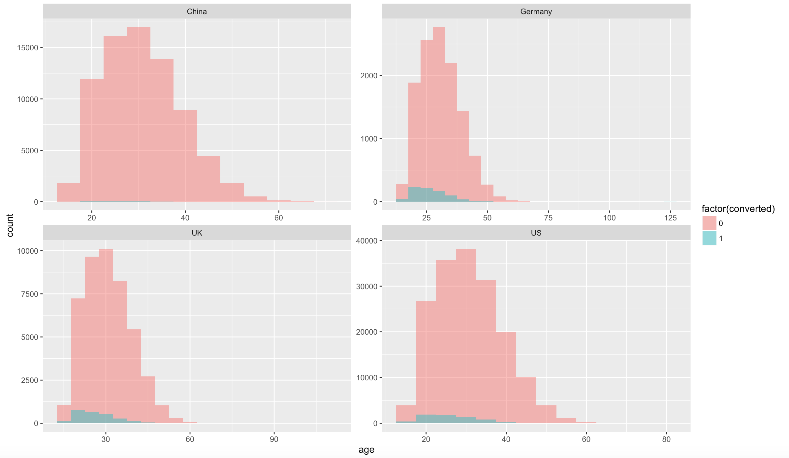 <br>
* Those users from China seldom converted

---
## EDA - age vs. source

```r
data %>% ggplot(aes(x=age,fill=factor(converted)))+ geom_histogram(binwidth = 5,alpha=.5, position="identity") + facet_wrap(~source,scales = "free")
```
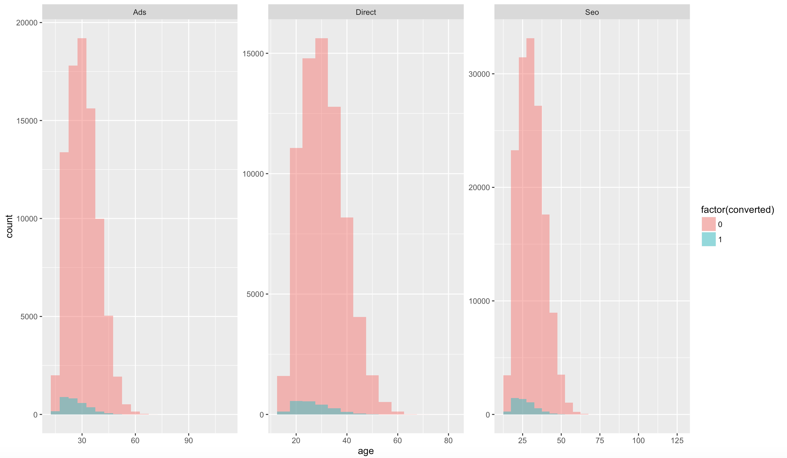 <br>

* no significant difference among sources

---
## EDA - age vs. new_user

```r
data %>% 
  ggplot(aes(x=age,fill=factor(converted)))+geom_histogram(binwidth = 5,alpha=.5, position="identity") + facet_wrap(~new_user,scales = "free")
```
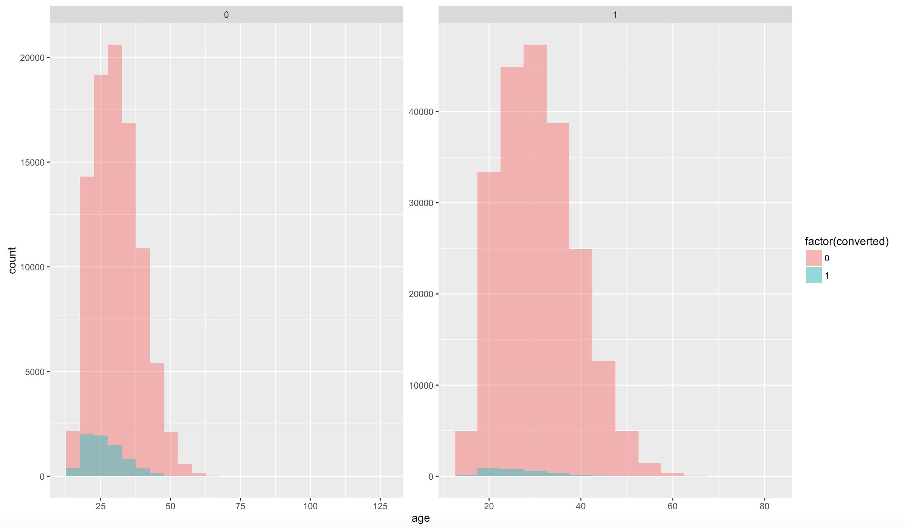 <br>

* no significant difference among sources

---
## EDA - age, source , country

```r
data %>% 
  ggplot(aes(x=age,fill=factor(converted)))+geom_histogram(binwidth = 5,alpha=.5, position="identity") + facet_wrap(~source+country,scales = "free")
```

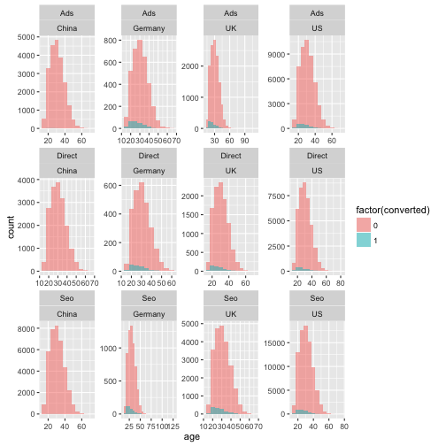

--- .dark .segue

## Machine Learning

---
## Machine Learning

```r
require(randomForest)
set.seed(9999)
data$converted = as.factor(data$converted) 
data$new_user = as.factor(data$new_user)
# split it into training/testing sets
train_sample = sample(nrow(data), size = nrow(data)*0.66)
train_data = data[train_sample,]
test_data = data[-train_sample,]
rf = randomForest(y=train_data$converted, x = train_data[, -ncol(train_data),with=FALSE],
  ytest = test_data$converted, xtest = test_data[, -ncol(test_data),with=FALSE],
  ntree = 100, mtry = 3, keep.forest = TRUE)
```

---
## Machine Learning

```r
rf
```
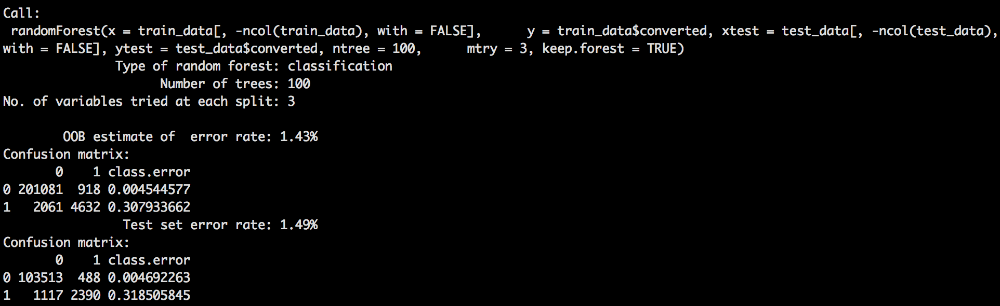

1. OOB and test error is similar, 1.43% vs. 1.49% <br>
2. 1.49% < 3.2% (if we classified everything as non converted) <br>
Let's the importance of each feature <br>

---
## Feature Selection

```r
varImpPlot(rf,type=2)
```
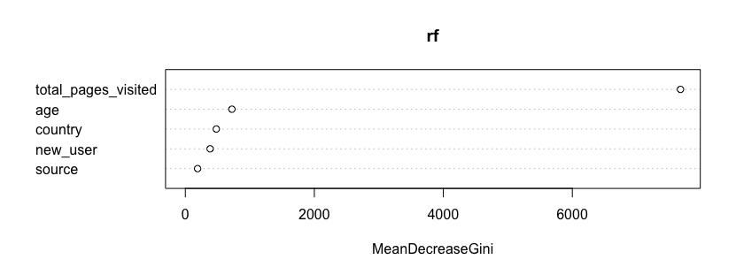
* The most important is total_pages_visited, which is not helpful
* People who want to purchase will also need to visit more

---
## Feature Selection
remove 'total_pages_visited' and try again

```r
rf = randomForest(y=train_data$converted, x = train_data[, -c(5, ncol(train_data)),with=FALSE],
  ytest = test_data$converted, xtest = test_data[, -c(5, ncol(train_data)),with=FALSE],
          ntree = 100, mtry = 3, keep.forest = TRUE,classwt = c(0.7,0.3))
```

---
## Feature Selection

```r
varImpPlot(rf,type=2)
```
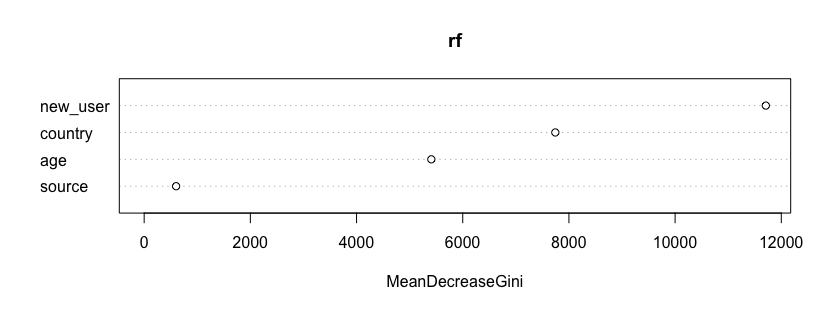
* New user is the most important feature
* Source is less important

---
## Partial Dependence Plot


```r
op <- par(mfrow=c(2, 2))
 partialPlot(rf, train_data, country, 1)
 partialPlot(rf, train_data, age, 1)
 partialPlot(rf, train_data, new_user, 1)
 partialPlot(rf, train_data, source, 1)
```
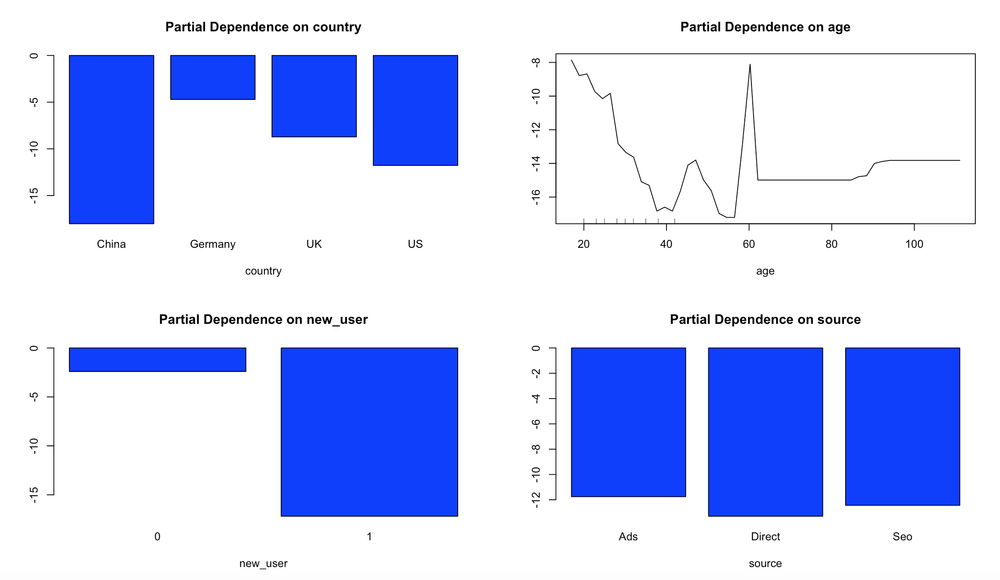

---
## Feature Selection

<br>
Insights: <br>
1.Users with an old account are much better than new users <br> 
2.China is really bad, all other countries are similar with Germany being the best <br>
3.The site works very well for young people and bad for less young people <br>
4.Source is irrelevant <br>

---
## Machine Learning
Use a simple decision tree to see the first few segments

```r
require(rpart)
(tree = rpart(data$converted ~ ., data[, -c(5,ncol(data))],
              control = rpart.control(maxdepth = 3),
      parms = list(prior = c(0.7, 0.3))))
```
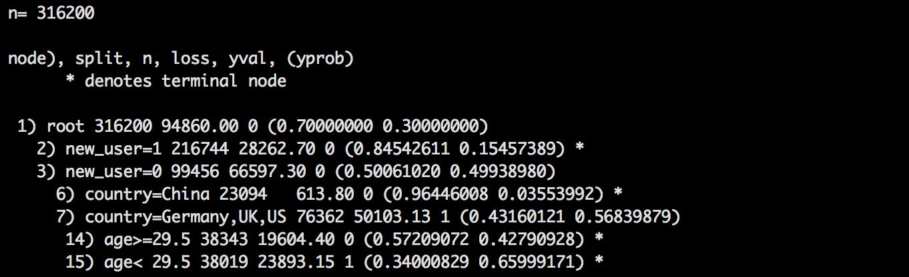

---
## Machine Learning

<br>
Implications:<br>
1. new_user is the first rule <br>
2. wether from China or not is the second rule <br>
2. 29.5 years old is a threshold for age <br>

--- .dark .segue

## Summary

---
## Summary
* The site is working very well for young users, so we could tell marketing to advertise and use marketing channel which are more likely to reach young people. <br>

* The conversion for Germany is high, but now the users from Germany is low, less than UK. However, the population in Germany is greater than UK. So, there is great opportunity at Germany.<br>

* Those with old accounts perform better at conversion rate. So maybe send them EDM to bring them back to our website will be a good idea. <br>

* The conversion rate for older users is relatively low. So the UX for older people might not friendly enough. <br>

* The conversion rate at China is terriblely low, it is probably either poorly translated,
or maybe it's totally in English. So it's very important to modify the UX for Chinese, the numbers of user from China is very amazing.

---


